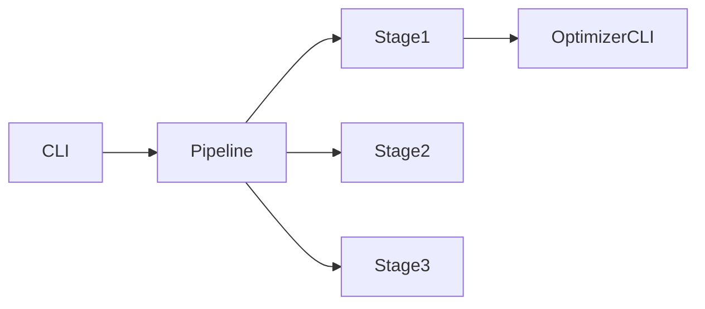

# Plan for CLI-Driven Configuration and Pipeline Refactoring

This document outlines the steps to introduce command-line configuration for Stage 1 and the complete training pipeline.

## 1. Goals

- **Stage 1 Optimizer**: Replace embedded constants with CLI arguments (`--num_combinations`, `--max_files_per_test`, `--num_files`, `--model_path`, `--data_dir`).
- **Pipeline Script**: Expose stage and tournament parameters via CLI flags and forward them to individual stages.

## 2. Scope

- Modify `optimization/blended_2pid_optimizer.py`
- Modify `run_complete_training_pipeline.py`
- Update documentation and examples
- Validate via `--help` and dry runs

## 3. Tasks

1. Refactor Stage 1 Optimizer
   - Add `argparse` import and argument definitions.
   - In `main()`, use parsed args for `model_path` and `data_dir` defaults.
   - Limit data files list by `--num_files`.
   - Call `optimize_comprehensive` with `--num_combinations` and `--max_files_per_test`.
   - Remove `--comprehensive` flag logic.

2. Refactor Pipeline Script
   - Add `argparse` import and CLI flags:
     - Stage 1: `--stage1-combinations`, `--stage1-max-files`, `--stage1-num-files`
     - Tournament 1: `--t1-rounds`, `--t1-pop-size`, `--t1-max-files`
     - Tournament 2: `--t2-rounds`, `--t2-pop-size`, `--t2-max-files`, `--perturb-scale`
   - Modify `run_stage_*` functions to accept `args` and build `cmd` accordingly.
   - Update `main()` to parse args once and pass to stage runners.
   - Remove hard-coded constants and obsolete flags.

3. Documentation
   - Update `README.md` or create `docs/PIPELINE_EXECUTION_GUIDE.md` with flag descriptions and examples.

4. Testing
   - Verify `--help` output for both scripts.
   - Perform dry run: e.g. `python run_complete_training_pipeline.py --stage1-combinations 5 --t1-rounds 2`

## 4. Execution Order

## 5. Success Criteria

- All constants become configurable via CLI.
- Pipeline flags propagate correctly to each stage.
- Documentation updated with examples.
- Tests and dry runs pass without errors.

-- End of Plan